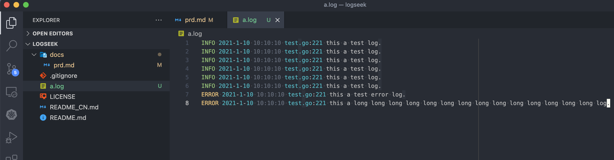
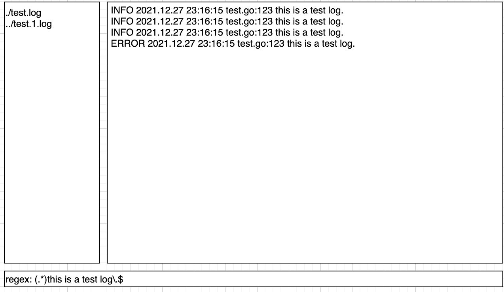
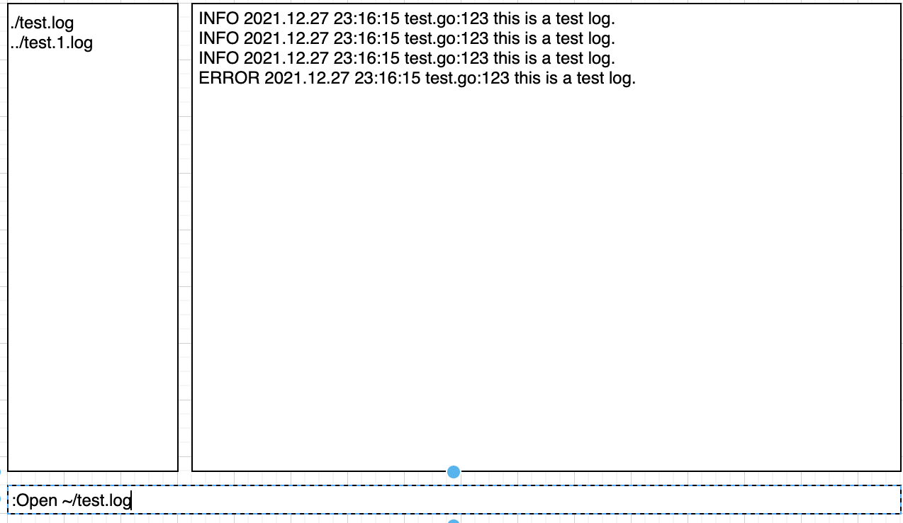

# LogSeeker 需求文档

## 解决什么问题？

开发者在本地调试分布式应用（特别是微服务应用）时，往往需要对不同目录甚至不同机器上的多个日志进行分析。
传统的命令行工具，如 tail, grep, awk 等，能够简单地对单个日志进行处理，但对多个日志却难以进行处理。
logSeeker 希望能够为开发者提供一个用户友好的界面，用于对分散的各个日志进行高效的处理。

## 竞品 -- linux less

## 产品原型





## 用例描述

1. 打开与关闭

打开：用户在命令行运行本程序如（./logseeker），即可进入上述界面；

进入程序后，状态栏显示:
```
logseeker: press h to enter help menu; press q to exit.
```

此时程序进入普通模式。普通模式下，会有常用的键盘快捷键供用户输入。

关闭：用户在程序中通过键盘输入q，即可退出。

2. 帮助菜单

用户在程序中通过键盘输入h后，在侧边栏显示帮助文档（待补充）。

按 esc 退出，继续显示当前已打开文件列表。

3. 命令行输入

按`: `进入命令行模式，此时下方显示冒号与光标，并显示用户输入的命令：

按esc 退出命令行模式，并显示当前状态。

4. 打开文件

在命令模式下输入`:Open` 或在普通模式下按 o (相当于自动输入`:Open`)，都会在命令行中让用户输入
对应的文件路径。
如果找不到对应的文件路径，则在命令行中报`file not found`；
如果找到，则在侧边栏已打开文件列表中加上该路径。超过的行数折行展示，并自动跳到最后一行。
同时，右边日志栏会自动跟踪该文件结尾处的变更；任何写入该文件的最新行将在日志栏中展示。

5. 已打开文件关闭

TODO
